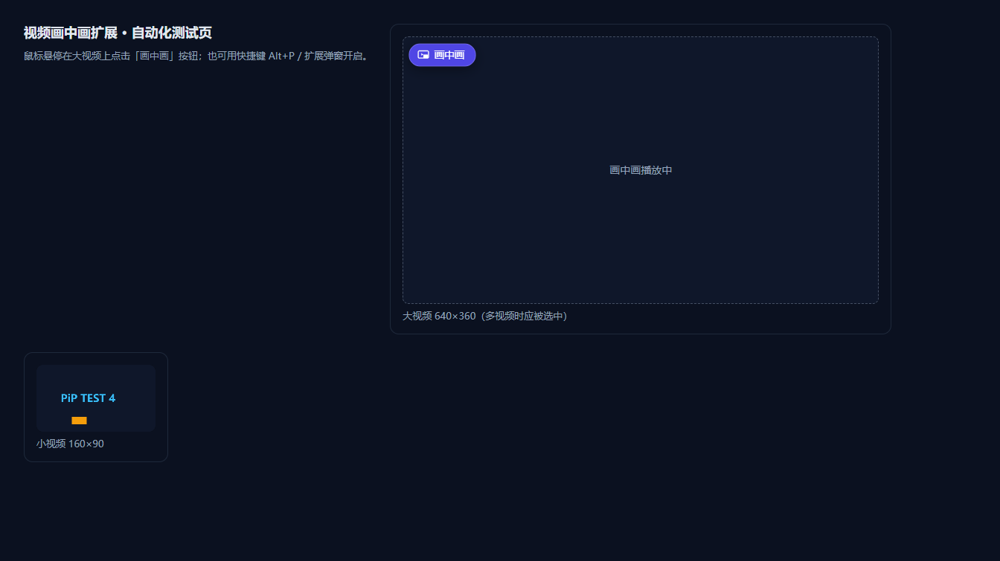
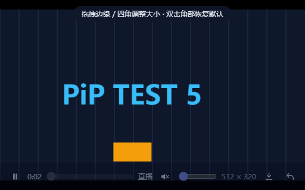

# 视频画中画 Plus（Video PiP Plus）

一款 Chrome / Edge 浏览器扩展（Manifest V3）：把任意网页视频放进**宽高可自由拖拽**的画中画浮动小窗，边看边干别的；顺带内置了实用的**视频解析下载**（直链 / m3u8-HLS / MSE 流式页面均支持）。

- 当前版本：**v1.2.0**（manifest_version 3，最低 Chrome / Edge 116）
- 纯原生 JS，**零依赖、零构建**：克隆即用，无需 npm install / 打包器
- 完全本地运行：无网络上报、无埋点、无广告

> 📥 **不想自己加载？** 直接下载 [`releases/video-pip-plus-v1.2.0.zip`](releases/video-pip-plus-v1.2.0.zip)，解压后按下方步骤加载即可。
> SHA-256：`afa5d0d10ef04437e6a36237f0691ea5776f67484edaaeb876835c71720bab3e`

## 功能特性

### 画中画

- **悬浮按钮**：鼠标悬停到任意视频上，左上角浮现「画中画」按钮，一键开启
- **自定义小窗**（Document Picture-in-Picture）：带完整控制条——播放/暂停、进度拖动、音量/静音、实时尺寸显示；直播流显示「直播」并禁用进度条
- **宽高随意拖拽**：小窗四条边、四个角均可拖拽调整，宽高互不锁定比例
- **尺寸自动记忆**：松手即保存（节流 400ms 写入），下次开启直接使用记忆尺寸；若浏览器忽略初始尺寸，窗口中央出现「应用上次尺寸」一键兜底；双击任意角恢复默认 512×320
- **三种开启方式**：悬浮按钮 / 工具栏弹窗 / 快捷键 `Alt+P` / 视频右键菜单（四选一）
- **原位置占位**：视频移入小窗后，原位置显示「画中画播放中」占位提示；关闭小窗自动放回原处
- **智能回退**：iframe 内视频或旧内核自动回退到原生 `requestPictureInPicture()`（系统小窗同样支持拖拽调大小）
- **自愈注入**：扩展安装/重载前已打开的标签页，打开弹窗即自动补注入脚本，**无需刷新页面**

### 视频解析下载（小窗控制条 ⭳ 按钮）

| 视频类型 | 行为 |
| --- | --- |
| http(s) 直链（mp4/webm 等） | 浏览器下载器后台下载，自动命名 |
| m3u8 / HLS（含 AES-128 加密） | 自动解析播放列表 → 并发 4 线程下载全部分片 → 解密 → 合并为 `.ts`；master 多码率自动选最高清；支持 fMP4 初始化段 |
| MSE 流式页面（B 站 / YouTube 等常见播放方式） | 后台自动嗅探页面请求中的 m3u8 地址并走解析下载 |
| 同源 blob 视频 | 读取数据后浏览器另存 |
| 直播 / 摄像头流（srcObject） | 明确提示无法下载 |

## 截图

| 悬浮按钮 | 画中画小窗 |
| --- | --- |
|  |  |

## 安装（开发者模式加载，1 分钟）

1. 打开 Chrome，地址栏输入 `chrome://extensions/` 回车
2. 打开右上角「开发者模式」开关
3. 点击左上角「加载已解压的扩展程序」
4. 选择本仓库的 **`extension/`** 文件夹（里面要有 `manifest.json`）
5. 建议：点浏览器右上角拼图图标 🧩，把「视频画中画 Plus」固定到工具栏

> **Edge 用户**：打开 `edge://extensions/`，同样开启开发者模式后加载，步骤一致。
> **本地 file:// 页面**使用需在扩展详情页开启「允许访问文件网址」。

详细使用说明（含下载功能细节与完整 FAQ）见 **[docs/USAGE.md](docs/USAGE.md)**。

## 目录结构

```
video-pip-plus/
├── extension/                 # 扩展本体（加载这一夹即可）
│   ├── manifest.json          # MV3 清单（权限最小化说明见下）
│   ├── background.js          # Service Worker：菜单/快捷键/自愈注入/m3u8 嗅探/下载编排
│   ├── content.js             # 内容脚本：悬浮按钮 + 自定义小窗 + 拖拽 + 下载入口
│   ├── content.css            # 页面内注入样式（悬浮按钮/占位/toast/确认层）
│   ├── popup.html/js/css      # 工具栏弹窗（状态检测 + 尺寸偏好设置）
│   ├── offscreen.html/js      # offscreen 文档：m3u8 解析、分片下载、AES-128 解密与合并
│   └── icons/                 # 16/48/128 图标（由 test/icon-gen.js 生成）
├── test/                      # 自动化验收与调试工具（详见 docs/TESTING.md）
│   ├── test.js                # 25 项验收测试（puppeteer-core 驱动 Chrome for Testing）
│   ├── icon-gen.js            # 图标生成器（纯 Node 手写 PNG 编码器，零依赖）
│   ├── debug-pip*.js          # 手动调试脚本
│   └── page*.html             # 本地测试页（普通/blob/MSE/加密流场景）
├── docs/
│   ├── USAGE.md               # 用户使用手册（安装/操作/下载/完整 FAQ）
│   ├── DEVELOPMENT.md         # 开发文档（架构、消息拓扑、m3u8 管线、修改指南）
│   ├── TESTING.md             # 测试指南（环境搭建、25 项清单、图标再生成）
│   └── PUBLISH.md             # 发布指南（git init → GitHub Release 全流程）
├── releases/
│   └── video-pip-plus-v1.2.0.zip   # 打包好的发行 zip
└── CHANGELOG.md               # 版本历史
```

## 工作原理（30 秒版）

```
┌────────────┐  ping/补注入   ┌─────────────────────────────┐
│ popup.html │ ─────────────▶ │ background.js (Service      │
│  尺寸偏好   │                │  Worker：嗅探 m3u8、编排下载、│
└────────────┘                │  调用 downloads API 落盘)     │
                              └──────────┬──────────────────┘
                    Alt+P / 右键菜单      │ tabs.sendMessage
                              ┌──────────▼──────────────────┐
        页面内视频 ──────────▶ │ content.js + content.css     │
                              │ 悬浮按钮 / Document PiP 小窗 / │
                              │ 拖拽调宽高 / 尺寸记忆          │
                              └──────────┬──────────────────┘
                        ⭳ 下载 m3u8 时    │ runtime 消息
                              ┌──────────▼──────────────────┐
                              │ offscreen.js（隐藏文档）       │
                              │ 解析 playlist → 并发下载分片 → │
                              │ AES-128 解密 → Blob 合并      │
                              └─────────────────────────────┘
```

技术要点：优先使用 **Document Picture-in-Picture API** 获得可编程的自定义小窗；m3u8 下载利用 **offscreen Document** 获得扩展级 fetch（绕过页面 CORS）+ 完整 DOM（`createObjectURL`）。逐层细节见 **[docs/DEVELOPMENT.md](docs/DEVELOPMENT.md)**。

## 权限说明（为什么需要）

| 权限 | 用途 |
| --- | --- |
| `storage` | 记住你的小窗尺寸偏好；缓存嗅探到的 m3u8 地址（`storage.session`，浏览器重启即清） |
| `contextMenus` | 提供「视频右键 → 画中画播放」菜单 |
| `scripting` | 向扩展安装/重载前已打开的页面自动补注入脚本（免刷新自愈） |
| `downloads` | 直链视频与 m3u8 合并产物落盘到「下载」文件夹 |
| `offscreen` | 创建隐藏文档执行 m3u8 分片下载、解密与合并 |
| `webRequest` | 只读嗅探网络请求中的 m3u8 播放列表地址（不修改、不拦截任何请求） |
| `host_permissions: <all_urls>` | 在任意网站的视频上工作；m3u8 分片的扩展级跨源下载 |

## 从源码运行 / 开发

```powershell
# 无需任何构建步骤：
git clone <本仓库>
# Chrome → chrome://extensions/ → 开发者模式 → 加载已解压的扩展程序 → 选 extension/ 目录

# 重新生成图标（可选，纯 Node 零依赖）：
node test/icon-gen.js

# 跑 25 项自动化验收（环境准备见 docs/TESTING.md）：
cd test && npm install && node test.js
```

修改指南（改默认尺寸 / 配色 / 下载行为等对照表）见 **[docs/DEVELOPMENT.md](docs/DEVELOPMENT.md)**。

## 常见问题（精选）

- **弹窗提示「此页面不支持画中画」？** 当前在浏览器内置页面（`chrome://`、应用商店、PDF 查看器等），这些页面禁止扩展注入，请切换到普通网页。
- **扩展刚安装/重载，旧标签页没反应？** 打开扩展弹窗即自动补装脚本，无需刷新；个别站点仍异常时刷新一次即可。
- **Netflix 等付费视频？** 受 DRM 版权保护，浏览器禁止画中画与下载，属正常限制。
- **m3u8 下载的 `.ts` 文件怎么播 / 转 mp4？** PotPlayer、VLC 可直接播放；转封装：`ffmpeg -i 文件.ts -c copy 文件.mp4`。
- **B 站点了下载没反应？** 页面还没加载出 m3u8，先播放几秒再点下载。

完整 FAQ 见 [docs/USAGE.md](docs/USAGE.md)。

## 兼容性

| 浏览器 | 支持情况 |
| --- | --- |
| Chrome 116+ | 完整支持（Document PiP 自定义小窗） |
| Edge 116+ | 完整支持（与 Chromium 同内核） |
| 更早版本 | 不支持（依赖 Document Picture-in-Picture API，Chrome 116 起提供） |

## 许可证

暂未指定开源许可证（保留所有权利，仅供学习与个人使用）。如需开源，建议自行添加 MIT 或 Apache-2.0 许可证文件。
